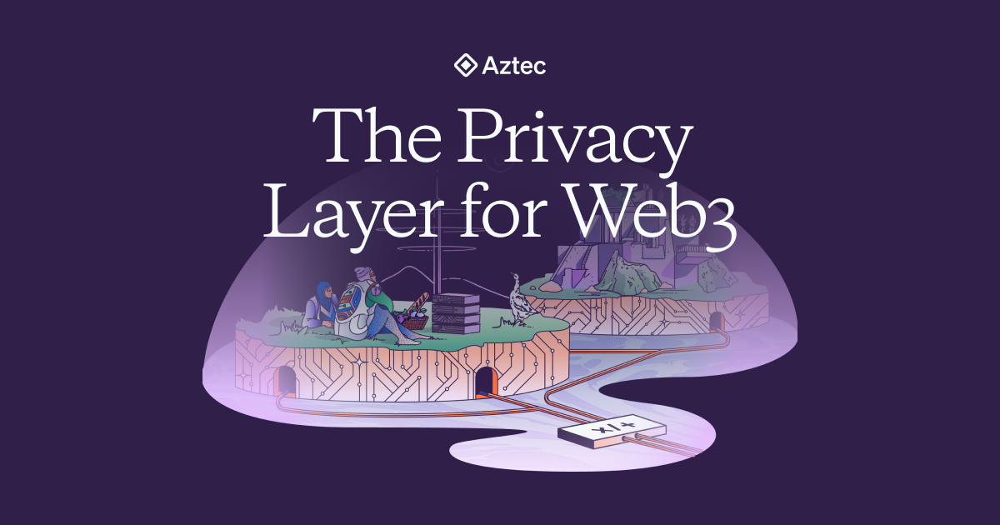
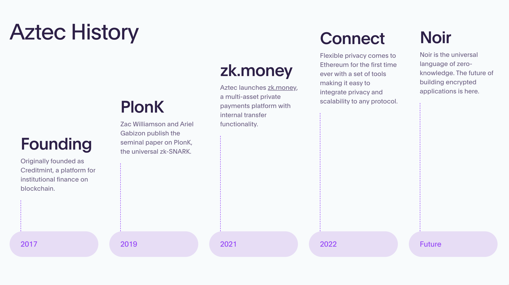
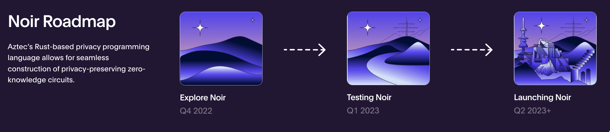
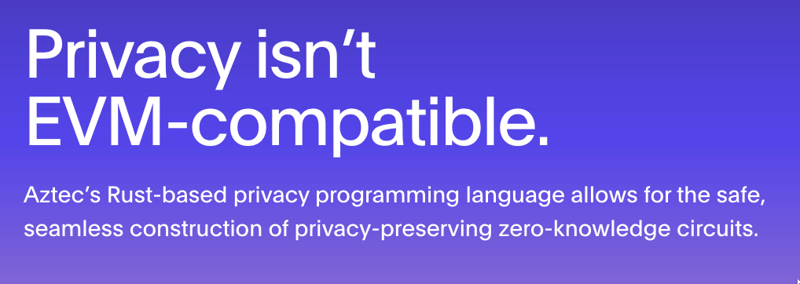
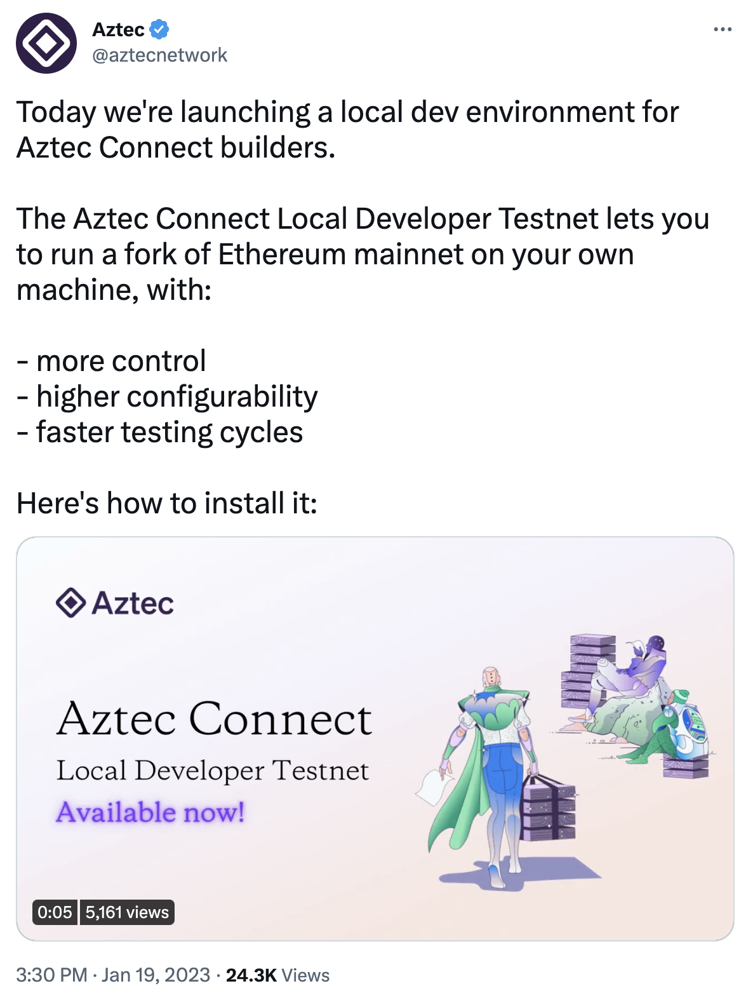
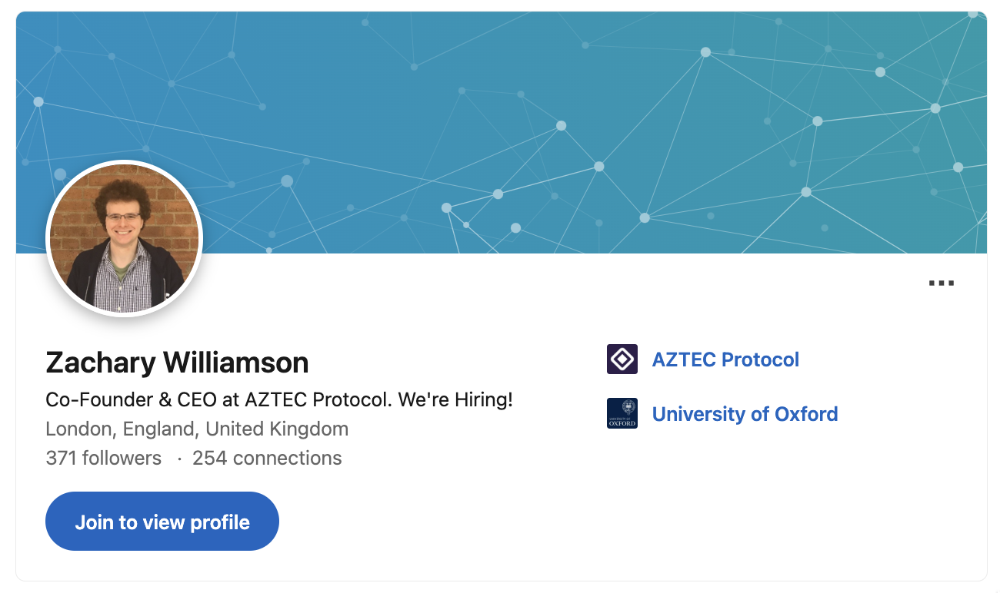
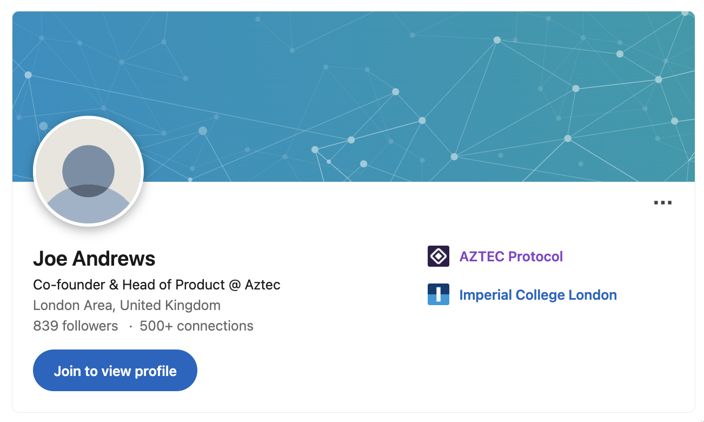
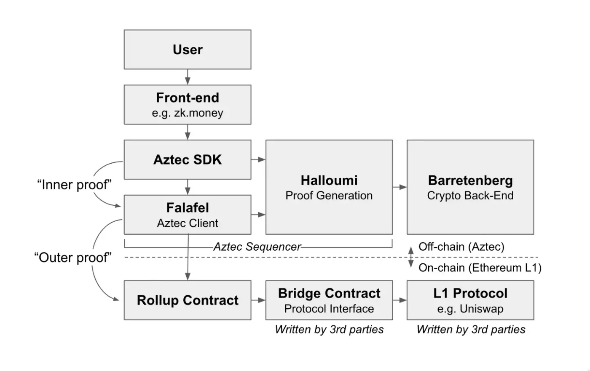

# AZTEC NETWORK

    

This zk-exploration paper aims to depict a global overview of the Aztec Network ZK project.

## Introduction

### What is Aztec network?

Aztec network is a private Zero-Knowledge rollup on Ethereum based on innovative in-house developed PLONK technology and Noir programming language. It claims itself as "the first and only private ZK-rollup on Ethereum". It has been founded in 2017 by Zac Williamson and Joe Andrews and has for goal to enable and improve Ethereum's privacy, security, efficiency and scalability through cryptography. 

## Technology

Aztec Network uses zk-PLONK zero-knowledge proof, a variant of zk-SNARK based on Groth16 and Sonic developed by its CEO, Zac Williamson. 

In addition Aztec network uses an in-house developed programming language called Noir, specifically tailored for zero-knowledge proof of computation. Their most used languages in their Github codebase are Javascript, C++, Rust, Typescript and Solidity.

For now Aztec serves as sole Sequencer of the network through running their geth like client called Falafel. In the long run the goal is so any user could run a sequencer hence decentralizing the network.

Aztec initially released some of its prover code under the Polaris license jointly created with StarkWare. Today all the code is released under the Apache 2.0 license.

## Roadmap

    

Aztec network has been founded in 2017 by Zac Williamson and Joe Andrews and received a 2.1M core investment under the leadership of Consensys. In addition to that in 2021 under the leadership of Paradigm received 17M in series A, amounting to a total of 20M. Finally in 2022, lead by a16z Aztec network received 100M funding in series B.

Their in-house language Noir is now in test phase and is set to release for Q2 2023+. 

    

Aztec network has built their Rust based language and is not EVM-compatible.

    

For now Aztec network seems to be in testnet for their main product Connect and their language Noir. Hence it seems safe to assume that they are still in building phase

## Team

    

Aztec network has a team of around 70 people and still hiring.

    

    

Zachary Williamson is a Doctor in Philosophy at the University of Oxford and also has a Masters in Physics. Served as a Software developer at Carallon Ltd. and was a cohort member at EF9 before founding Aztec protocol.

    

    

    

 Joe Andrews co-founded multiple tech companies and served as a software engineer in multiple as well.

## Examples and Diagrams

    

1. User submits a tx.
2. Aztec SDK encrypts tx and builds proof.
3. Proof is sent to Sequencer (Falafel) for proof bundling. (Inner proof)
4. Sequencer sends bundle of proofs to rollup contract. (Outer proof)
5. Rollup contract interacts with bridge contract.
6. Bridge contract interacts with L1 protocol for tx integration.

## Resources

Main website: [https://aztec.network](https://aztec.network)

Plonk Whitepaper: [https://eprint.iacr.org/2019/953.pdf](https://eprint.iacr.org/2019/953.pdf)

Aztec network explained: [https://medium.com/aztec-protocol/explaining-the-network-in-aztec-network-166862b3ef7d](https://medium.com/aztec-protocol/explaining-the-network-in-aztec-network-166862b3ef7d)

Aztec network roadmap: [https://medium.com/coinmonks/get-started-with-aztec-network-blockchain-roadmap-d84103c2d9da](https://medium.com/coinmonks/get-started-with-aztec-network-blockchain-roadmap-d84103c2d9da) 

Aztec protocol Linkedin: [https://uk.linkedin.com/company/aztec-protocol?trk=public_profile_topcard-current-company](https://uk.linkedin.com/company/aztec-protocol?trk=public_profile_topcard-current-company)
