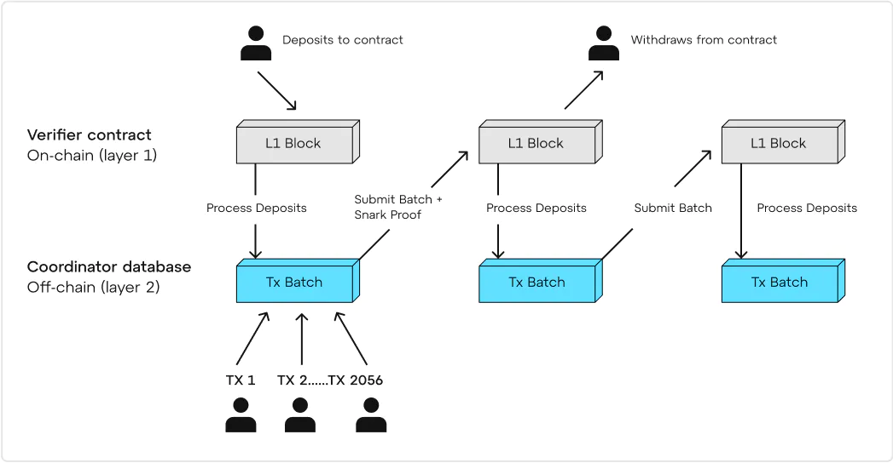
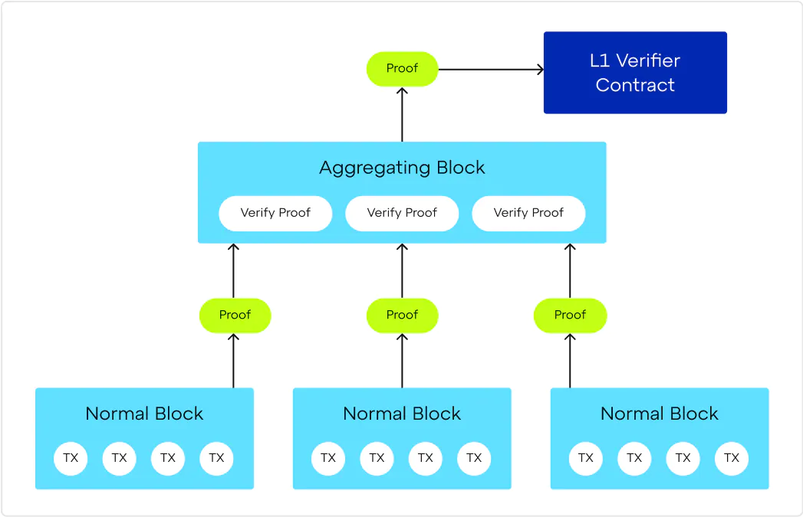

# Linea

[Linea Main Documentation](https://docs.linea.build/overview)

Linea is a Type 2 zkEVM.

Smart contracts are written using **Solidity**  

Public Testnet Launch Date -> March 28, 2023  
Current State -> Mainnet Alpha  
Mainnet Alpha Launch Date -> July 18, 2023

## Technical paper

### Architecture of Linea
- 1. Canonical Messaging Service (CMS)
- 2. Coordinator
- 3. Sequencer
    - 3.1. Traces Generator
    - 3.2. Conflation
- 4. EVM State Manager
- 5. Trace Expansion and Proving
    - 5.1. Proving: Circuit building
    - 5.2. Proving: Circuit execution and runtime
### 1. Canonical Messaging Service (CMS)
The Canonical Message Service (CMS) enables the transfer of data and assets between Linea and other blockchains. It uses smart contracts and Postbots to pass user-specified messages between networks. The CMS is not limited to Linea and can be used by developers and end users. In Layer 2, Linea employs the Coordinator, but details are not provided.

### 2. Coordinator
The Coordinator moves information internally, between different parts of Linea’s execution client, and externally, with other blockchains, Linea’s data availability stack, and the nodes syncing its own network state. In this way, the Coordinator is Linea’s consensus client.

### 3. Sequencer
The sequencer is a crucial component of Linea's execution client, responsible for ordering, building, and executing blocks to enable subsequent zero-knowledge proofs. It determines the sequence of transaction execution, builds blocks, and prepares data for the zero-knowledge prover. Initially based on zkGeth, Linea is transitioning to zkBesu, a custom-modified version of the Besu client. The sequencer communicates with the Coordinator to ensure blocks are provable and compact, optimizing data storage on Ethereum Mainnet. It includes subsystems like the Traces Generator and Conflator.

#### 3.1. Traces Generator

The Traces Generator is a component of Linea's sequencer responsible for producing data used by the prover to create zero-knowledge proofs. It executes blocks built by the sequencer and preserves transaction traces, which specify the network and account states at each step of execution. These traces are essential for generating proofs, ensuring Linea's zero-knowledge technology maintains privacy while validating transactions on Ethereum. The traces are also put through trace conflation to make them as compact as possible.

#### 3.2. Conflation

Conflation is the process of combining multiple blocks' worth of transactions into one dataset in a zkEVM environment. It allows for the creation of a "before and after" map of the network state (Merkle tree) and a zero-knowledge proof that is published to Ethereum.

In zkEVM, the source of truth is the data submitted to Ethereum, including the ZK proof, transactions, and Merkle tree. Conflating multiple blocks into one makes Linea's proving system more efficient by focusing on how many transactions fit in a proof, rather than fitting them in discrete blocks as in mainnet Ethereum.

The conflation process occurs within the execution client and involves communication with the Coordinator. The conflator waits for traces files to appear, marks them as "merged," and checks if more block data can be added without exceeding the limit. Once the time limit is reached or the data is ready, the conflated trace data is passed back to the Coordinator for Merkle tree and proof generation.

### 4. EVM State Manager

The EVM State Manager is a component of Linea's execution client responsible for updating the global network state and the state of individual accounts.

It receives executed blocks from the sequencer and uses trace data to update the network state. The state of each account is represented by a hash, allowing for efficient representation of changes in account states using Merkle trees.

Linea's zkBesu implementation uses a Sparse Merkle Tree, optimizing data storage and efficiency. The state manager's main functions are updating the network state and generating proofs for submission to Ethereum.

Upon receiving an executed block, the state manager updates the state of affected accounts in the Merkle tree based on the trace data. The new network state is then passed to the prover to create a proof for Ethereum submission.

### 5. Trace Expansion and Proving

Trace Expansion and Proving is a module responsible for generating the final data for a zero-knowledge proof and producing the zkSNARK proof.

It receives multiple sets of information from the Coordinator and zkBesu. The process involves two parts: Corset and gnark. Corset takes conflated trace data from the Coordinator and prepares it. Then, gnark takes the prepared (expanded) trace data and generates a proof that can be submitted to Ethereum as a succinct, non-interactive argument of knowledge (zkSNARK).

#### 5.1. Proving: Circuit building

Corset is the first part of the prover component in Linea's architecture for zk-EVM. It takes traces, expands them, and prepares them for the prover.

Corset performs its tasks through two paths: First, it creates a constraint system for Linea's zk-EVM environment, allowing mathematical proofs of certain conditions without revealing the underlying data. Second, Corset helps process data for every submitted block by preparing trace data for gnark, a component that produces the final zk-SNARK proof.

Corset uses a Domain-Specific Language (DSL) written in Lisp to build a tailored constraint system, which is then compiled into Go. It serves as the bespoke data preparation system for gnark, the final executor of Linea's proving system.

#### 5.2. Proving: Circuit execution and runtime

gnark is the final part of the prover in Linea's architecture for zk-EVM. It can also be used as standalone software to create cryptographic circuits in other projects.

gnark serves two main functions: first, it prepares a set of cryptographic circuits, also known as constraint systems, to create zk-SNARK proofs that can be verified in Ethereum's L1 environment. Second, it generates the actual zk-SNARK proofs.

gnark's codebase consists of two separate APIs: the frontend and the backend. The frontend API translates Corset's precompiled Go constraint system into the final set of circuits that produce the zk-SNARK proof. The backend API is used at runtime to process data through the prepared circuits, producing the proof.

The result is a set of provably real and correct transactions executed in an EVM environment, ready to be dispatched to Ethereum's L1 network. The proof is sent back to the Coordinator for validation.

## Synthetised zkEVM Transaction Flow

## Development Phases
**Phase 0:** Linea Mainnet Alpha launch with EVM-equivalent zkEVM, forming the Security Council, and providing public access to the client software for verification.

**Phase 1:** Introducing the Open Source Stack, licensing the Linea software under AGPL-3.0, and achieving 100% EVM Coverage in zkEVM arithmetization.

**Phase 2:** Diversifying the Security Council and enabling Censorship Resistant Withdrawals to empower users with control over their assets.

**Phase 3:** Decentralizing the roles of Provers and Sequencers, and decentralizing governance to involve community stakeholders in decision-making.

**Phase 4:** Implementing a Multi-Prover rollup for enhanced reliability and exploring diverse zkEVM implementations. Limiting Governance Powers to allow only necessary upgrades and defining the Security Council's role in critical system issues.
### Connection Information
***Network name:*** Linea Mainnet  
***RPC URL:*** https://linea-mainnet.infura.io/v3/  
***Chain ID:*** 59144  
***Currency symbol:*** ETH  
***Block explorer URL:*** https://lineascan.build  

## Technical Spesifications

Currently only the client which will be used is opensource. 
They are currently using a Geth version modified with zk functionalities it is called zkGeth which is written in Go.
They will move to [zkBesu (linea-besu)](https://github.com/Consensys/linea-besu) which is a version of Besu modified with zk functionalities, and written in Java.
  
[First commit](https://github.com/hyperledger/besu/commit/f8c5db07fca2c3f0203c2dbc76e48c3998c8fda7) after forking Besu was done by fab-10 at Jun 14, 2023

**Some of the Team Members and Contributors of Linea zkEVM**
- Fabio Di Fabio ([fab-10](https://github.com/fab-10)) - Commits on [linea-besu](https://github.com/Consensys/linea-besu)
- [garyschulte](https://github.com/garyschulte) - Commits on [besu-shomei-plugin](https://github.com/Consensys/besu-shomei-plugin)
- Julien Marchand - Head of Engineering
- Vijay K. - Head of Operations
- Ludovic Courcelas - Head of Delivery
- Emanuele Coscia - Growth Manager

## Resources

- https://docs.linea.build/
- https://linea.mirror.xyz/qD18IaQ4BROn_Y40EBMTUTdJHYghUtdECscSWyMvm8M
- https://github.com/Consensys/linea-besu
- https://github.com/Consensys/besu-shomei-plugin
