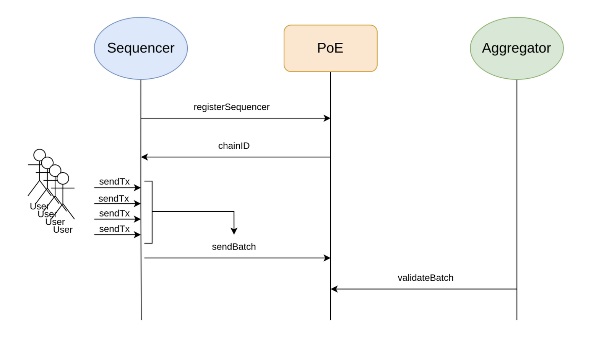
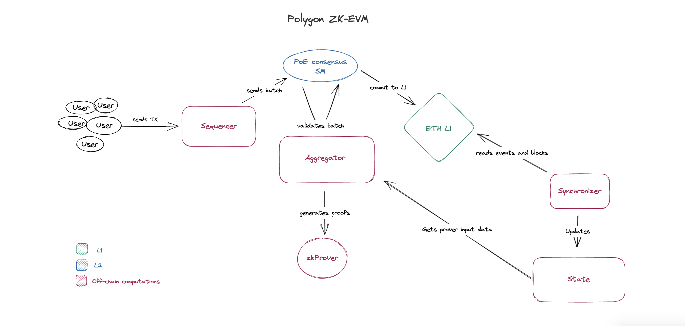

# Polygon zkEVM

[Main documentation found at](https://docs.hermez.io/zkEVM/Overview/Overview)

The Polygon zkEVM is a **Type 2** zkEVM.

Predecessor Polygon Hermez 1.0. deployed on March 2021 -> Proof of Donation.

Smart contracts are written using **Solidity**

Public testnet launched in oct 2022 -> security audit happened and they revealed new milestones -> improved transactions proof generation down from 10 to 4 minutes
first testnet version will be deprecated in January 2023

Consensus algorithm -> PoE Proof of Efficiency

## Technical paper
We can separate zkEVM in 3 big parts :
- Sequencer / Aggregator
- Prover
- Smart contract running PoE consensus

The former zkEVM was running a Proof of Donation consensus. Not it is using a Proof of Efficiency consensus mechanism. Like the previous PoD version it supports permissionless participation of multiple coordinators to produce batches in L2.

[**You can find a detailled explanation on the differences between the two mechanism here**](https://docs.hermez.io/zkEVM/Overview/Overview/#consensus-algorithm-proof-of-efficiency)

**Sequencers**:
receives L2 transactions and are in charge to generate batches which are then proposed to smart contract.

**Aggregator**:
receives transaction informations from Sequencer and sends it to prover that generates small zk-proof. Smart contract then verifies the proof from the prover is correct.



### Synthetised zkEVM transaction flow



The EVM is functioning the given way. Users can can send transactions by the way of having a wallet connected to zkEVM rpc network.
Once these transactions are signed by customer rpc they are pushed to a mempool and then pulled by the sequencer. After this the sequencer batch the transactions to send them to the PoE smart contract. The aggregator is then playing its own role to validate and consolidate transaction batches to the smart contract. To finish the batches of transactions are then committed to L1.

### Some more words on zkProofs
To prove transactions off-chain, Polygon zkEVM leverages Stark proof builder and SNARK proof builder. The zkProver is composed of state machines (Main and Secondary) and zk proof builders as mentioned above.
- **Main State Machine** : it handles the execution of the EVM bytecode that are interpreted by zkASM language. It also sets up the polynomial constraints that every valid batch transactions must satisfy.
- **Secondary State Machine** : is not a subcomponent per se, but a collection of various executors for individual secondary state machine.
- **STARK proof builder** : used to prove that batches satisfy polynomial constraints.
- **SNARK proof builder** : used to prove the correctness of STARK proofs. They are published as validity proofs.

Graphical representation of the flow can be found [there](https://app.excalidraw.com/l/8WWU7eJs953/19EvHYwlOHM)


### Here are the connection informations.
---
* Open the Bridge URL: https://public.zkevm-test.net/login
* Click “Add to Metamask”
* ChainID: 1422
* Network Name: Polygon zkEVM Testnet 
* RPC URL: https://rpc.public.zkevm-test.net
* Currency Symbol: ETH
* Block Explorer URL: https://explorer.public.zkevm-test.net


## Backend language

Mainly javascript.

zkEVM node is backed by go 
- first commit nov 2021

zkEVM proover is mainly c++
- first commit nov 2021

Project began around Q3/4 of 2021.
Around 15 core contributors on the whole project. Althought project has 3 members

Mainnet release should come soon.

Team leader Jordi Baylina for Polygon zkEVM coinvented circom

Opcode example, in the zkASM language

```zkASM
opADD:
    SP - 2          :JMPN(stackUnderflow)
    SP - 1 => SP
    $ => A          :MLOAD(SP--)
    $ => C          :MLOAD(SP)
    ; Add operation with Arith
    A               :MSTORE(arithA)
    C               :MSTORE(arithB)
                    :CALL(addARITH)
    $ => E          :MLOAD(arithRes1)
    E               :MSTORE(SP++)
    1024 - SP       :JMPN(stackOverflow)
    GAS-3 => GAS    :JMPN(outOfGas)
                    :JMP(readCode)
```


### Resources
---
[Detailed Polygon zkEVM flow](https://docs.hermez.io/zkEVM/Overview/Overview/)

[zkEVM Flow](https://app.excalidraw.com/l/8WWU7eJs953/19EvHYwlOHM)

[Proof of Efficiency research paper](https://ethresear.ch/t/proof-of-efficiency-a-new-consensus-mechanism-for-zk-rollups/11988)
