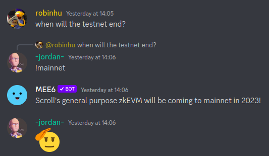
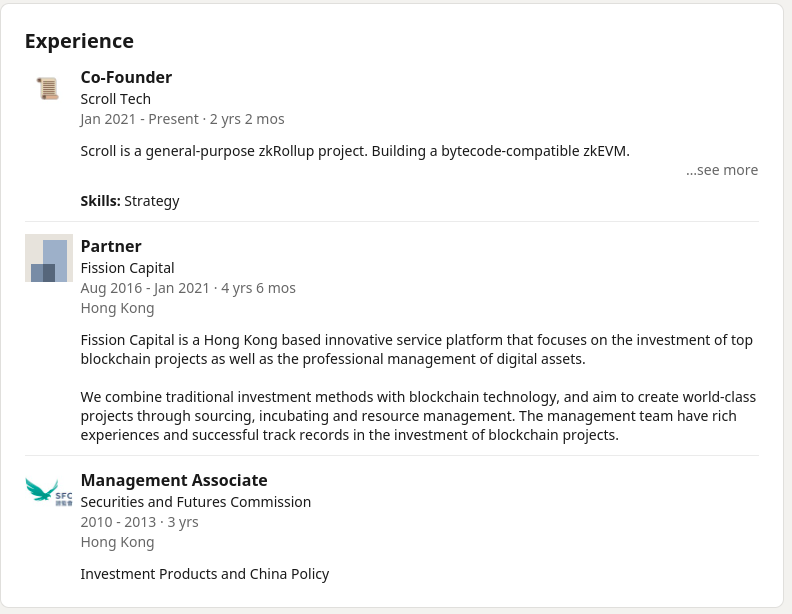
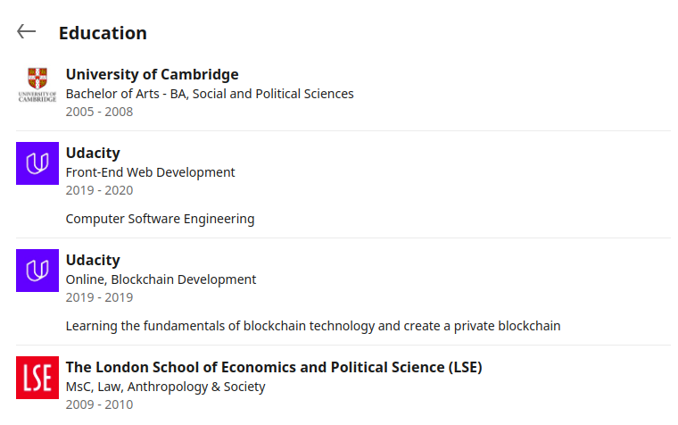
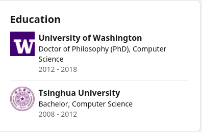
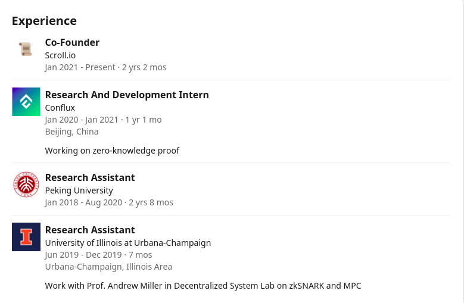
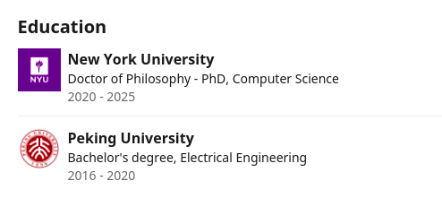

# Scroll zkEVM :

## Programming language to code the VM:
Rust 🦀

##  Type of zk technology used for proving computation (SNARK, STARK, etc.)

## zkEVM type
Currently, Scroll is a type 3 zkEVM but they aim for a type  2.

## How many people are approx. in the team
The 3 co-founders are listed in the team section of the website. There are 17 people who did more than 10 commits on the repo, and 55 total contributors. The LinkedIn profile of Scroll lists 30 employees. Also, they follow 28 people on Twitter. Based on that info we can infer ther there are 20±5 devs in a team of ~30.

## Time of inception

The first commit was made on June 29th 2021, which coincides with what is said in the launch blog post ("After one year of working", the post was published on July 19th 2022).

##  Type of stack used for networking and consensus (single sequencer? single prover? open sourced?)

## Testnet ready? Open? Beta, Alpha? : 

The testnet is open, in "pre-alpha" stage. Their L1 and L2's RPC are a subdomain of scroll.io. The Pre-Alpha was released on 2022-07-19, after one year of building, and upgraded three months later on 2022-10-09

## Date (if any) of production readyness
Sometime in 2023, according to their discord :

## Team leader prior experience, if any

Core team : 

- Sandy Peng : 
    - Experience : 
    - Education : 

- Haichen Shen : 
    - Worked at Amazon Web Services as a senior applied scientist on AI compilers. Received his Ph.D. in computer science from University of Washington, advised by Professor Arvind Krishnamurthy and Matthai Philipose. Received his bachelor degree in computer science from Institute for Theoretical Computer Science at Tsinghua University.
    - Published a few papers, mainly in NN 
    - Experience : 
    - Education : 

- Ye Zhang
    - Experience : 
    - Education : 

##  Code snippet for a simple opcode commented and explained (e.g. ADD or MUL)
## Final: diagram of the zkEVM flow for a single Tx (from dApp to L1 commitment)
